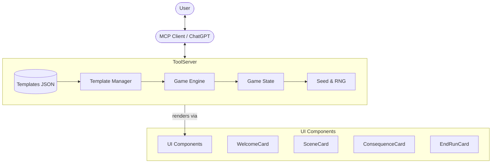

# Game Factory

> AI-native endless game generator for ChatGPT Store (MCP Server)

Built by [KikuAI](https://kikuai.dev). Create unique text-adventure games in 2 clicks and play endlessly. No prompts, registration, or payment required for basic play.

[](https://github.com/KikuAI/game-factory/actions/workflows/ci.yml)
[](https://opensource.org/licenses/MIT)

## 🌟 Features

- **2-Click Start**: Choose one of the 6+ curated genres and start playing immediately.
- **Endless Variety**: AI generates unique scenes, encounters, and outcomes every time.
- **Deep Mechanics**: Persistent state including HP, supplies, inventory, and threat levels.
- **Deterministic Seed**: Every run is shareable via seed codes. Challenge your friends!
- **MCP Native**: Plugs directly into ChatGPT or any MCP client for a rich UI experience.
- **Content Safety**: Built-in filters and rules ensure a 13+ safe experience.

## 🏗 Architecture



## 🛠 MCP Tools

| Tool | Description | Input |
|------|-------------|-------|
| `list_templates` | Browse curated game templates (Fantasy, Sci-Fi, Cyberpunk, etc.) | `genre`, `featured` |
| `start_run` | Initialize a new game session with selected settings. | `templateId`, `genre`, `difficulty` |
| `act` | Execute a player action (choice or consequence). | `actionId`, `runRef`, `clientTurn` |
| `end_run` | Gracefully end a session and get a performance summary. | `runRef`, `reason` |
| `export_challenge`| Generate a shareable seed and challenge text. | `runRef` |

## 🚀 Quick Start

### Installation

```bash
pnpm install
```

### Development

```bash
# Start MCP server with hot-reload
pnpm run server

# Run tests
pnpm run test

# Type checking
pnpm run typecheck
```

### Build

```bash
# Build server and widgets
pnpm run build
```

## 🎮 Game Rules

1. **Survival**: Keep your HP and Supplies above 0. Dying or running out of supplies ends the run.
2. **Progression**: Each successful action increases your progress (0-100%).
3. **Risk/Reward**: Safe actions have no risk but low reward. Risky actions (indicated by %) can fail but offer better progress or items.
4. **Threat Level**: The world becomes more dangerous as you progress. Higher threat levels increase the risk of failure.

## 📁 Project Structure

- `src/server/`: Core MCP server and game engine.
- `src/widgets/`: React components for visual rendering in compatible clients.
- `templates/`: Curated game definitions in JSON format.
- `tests/`: Comprehensive test suite for game logic and seed determinism.

## 🤝 Contributing

Contributions are welcome! Please see [CONTRIBUTING.md](CONTRIBUTING.md) for details.

## 🛡 Security

For security concerns, please refer to [SECURITY.md](SECURITY.md).

## 📄 License

This project is licensed under the MIT License - see the [LICENSE](LICENSE) file for details.
